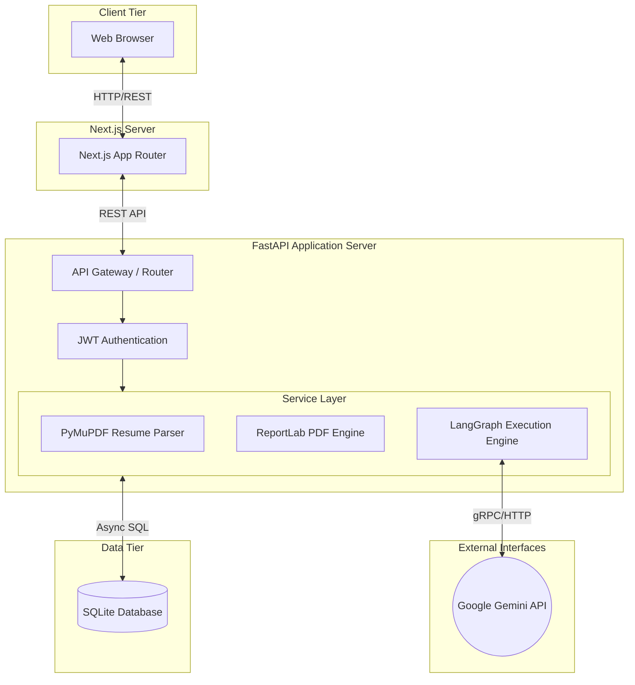
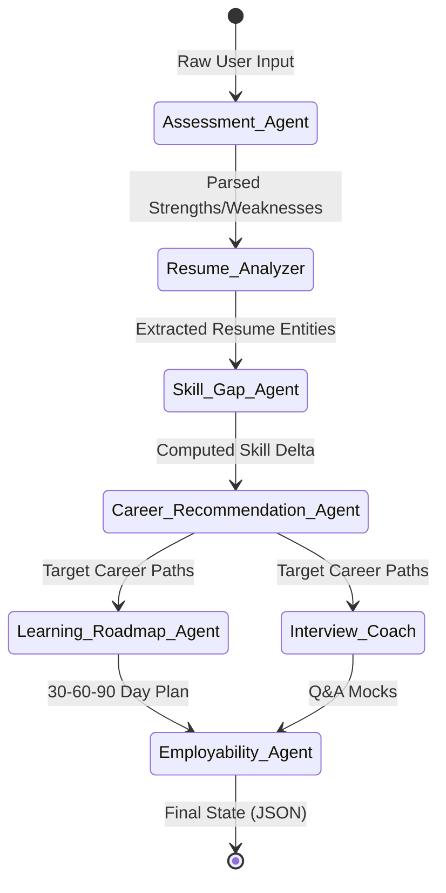
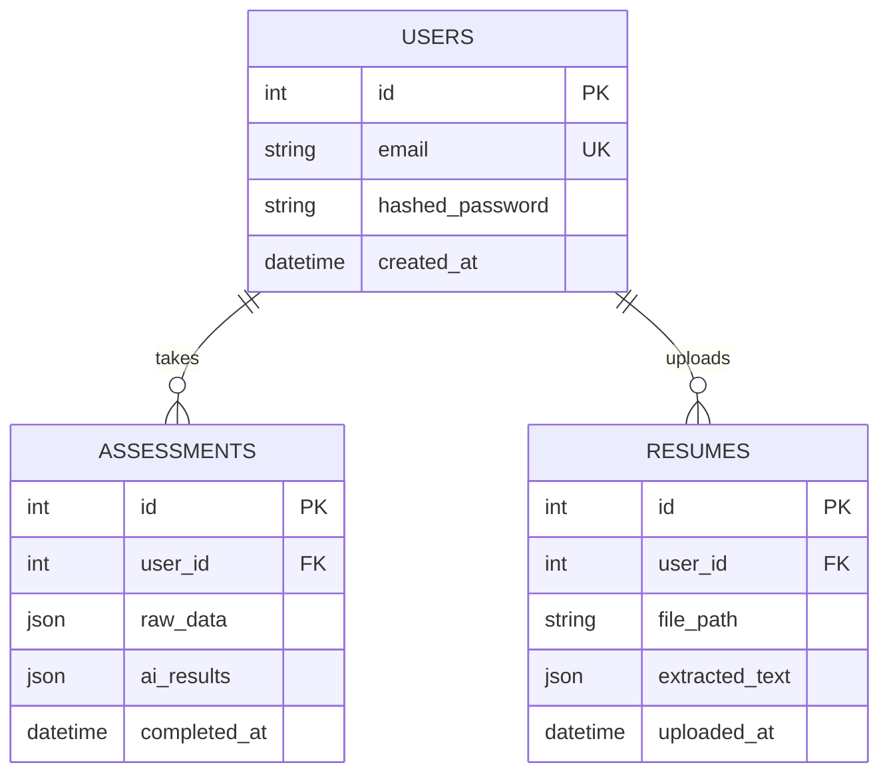
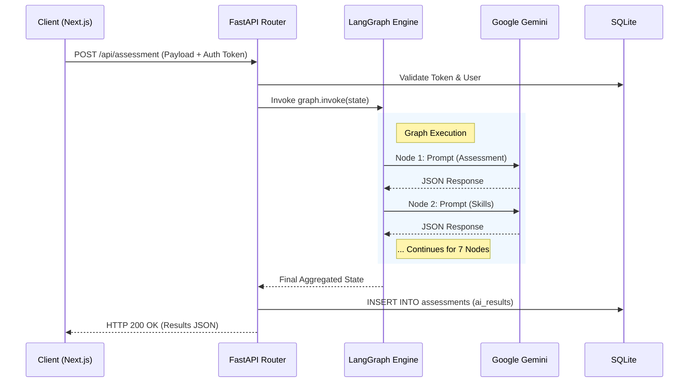

# 🌟 SheStarts AI Career Counselor

<div align="center">
  
  
  
  
  
  
</div>

<br />

An enterprise-grade, event-driven AI platform architected to facilitate workforce reentry for women. By employing a multi-agent Directed Acyclic Graph (DAG) orchestration model over Large Language Models (LLMs), the system automates resume parsing, skill gap analysis, and generates deterministic career progression roadmaps.

---

## 📑 Table of Contents
- [1. Executive Summary](#1-executive-summary)
- [2. System Architecture (HLD)](#2-system-architecture-hld)
- [3. LLM Agent Orchestration (LLD)](#3-llm-agent-orchestration-lld)
- [4. Data Model & Schema](#4-data-model--schema)
- [5. Sequence Flow](#5-sequence-flow)
- [6. API Specifications](#6-api-specifications)
- [7. Development Setup](#7-development-setup)

---

## 1. Executive Summary

### 🎯 Problem Statement
Women returning to the workforce often face a "confidence gap" and lack awareness of modern industry requirements. Traditional counseling is unscalable and lacks real-time, data-driven skill mapping.

### 💡 Solution
SheStarts leverages a swarm of specialized AI agents built on **Google Gemini 1.5 Flash** and **LangGraph** to process user data (assessment + resume) concurrently, outputting a highly personalized, actionable JSON state that is rendered into dynamic UI dashboards and downloadable PDF reports.

---

## 2. System Architecture (HLD)

The system follows a strict 3-tier decoupling:
1. **Presentation Layer:** Next.js (App Router, Server Components + Client Hooks).
2. **Application Layer:** FastAPI serving as an asynchronous API gateway and compute orchestrator.
3. **Data Layer:** SQLite utilizing `aiosqlite` for non-blocking asynchronous I/O with SQLAlchemy ORM.



---

## 3. LLM Agent Orchestration (LLD)

The core cognitive engine is implemented using a **LangGraph State Graph**. Instead of a single LLM call, the state is passed sequentially and conditionally through 7 specialized agents, ensuring high accuracy and separation of concerns.



**Node Responsibilities:**
- **Assessment Agent:** Contextualizes unstructured bio-data.
- **Resume Analyzer:** Named Entity Recognition (NER) for skills, education, and experience using zero-shot prompting.
- **Skill Gap Agent:** Cross-references user skills against industry-standard benchmarks.
- **Career Recommendation Agent:** Employs cosine similarity logic (via LLM semantics) to map profiles to top 5 roles.
- **Learning Roadmap Agent:** Time-series based curriculum generation.
- **Interview Coach:** Behavioral and technical prompt engineering.
- **Employability Agent:** Final aggregation and heuristic scoring (0-100).

---

## 4. Data Model & Schema

Data persistence is managed via SQLAlchemy 2.0 with async engine support.



---

## 5. Sequence Flow

The following sequence illustrates the synchronous processing of a user's career assessment request.



---

## 6. API Specifications

| Method | Endpoint | Description | Auth Required |
|--------|---------|-------------|---------------|
| `POST` | `/api/auth/register` | Create a new user account | ❌ |
| `POST` | `/api/auth/login` | Authenticate and issue JWT | ❌ |
| `POST` | `/api/assessment` | Trigger the LangGraph AI pipeline | ✅ |
| `GET`  | `/api/assessment/history`| Fetch user's past assessment data | ✅ |
| `POST` | `/api/resume/upload` | Upload PDF and trigger PyMuPDF parser | ✅ |
| `GET`  | `/api/report/download`| Stream dynamically generated PDF report | ✅ |

*For full schemas and interactive testing, run the server and visit `http://localhost:8000/docs` (Swagger UI).*

---

## 7. Development Setup

### 🛠 Prerequisites
- **Node v20.x** (NVM recommended)
- **Python 3.10+** (pyenv or conda recommended)
- **Git**

### 💻 Local Environment Initialization

**1. Clone the repository:**
```bash
git clone https://github.com/Amansingh223/Career-Counselor-AI-.git
cd Career-Counselor-AI-
```

**2. Backend Setup (FastAPI):**
```bash
cd backend
python -m venv venv

# Activate Virtual Environment
# Windows:
.\venv\Scripts\activate
# Linux/Mac:
source venv/bin/activate

pip install -r requirements.txt

# Configure Environment Variables
echo GEMINI_API_KEY="your_api_key_here" > .env
echo SECRET_KEY="your_jwt_secret" >> .env

# Start ASGI Server
python -m uvicorn main:app --reload --port 8000
```

**3. Frontend Setup (Next.js):**
Open a new terminal window:
```bash
cd frontend
npm install

# Start Turbopack dev server
npm run dev
```

**4. Windows Quick-Start:**
For rapid local bootstrapping on Windows, execute the provided batch script from the root directory:
```cmd
.\start.bat
```

---
*Architected and engineered for high-throughput, low-latency AI orchestration.*
