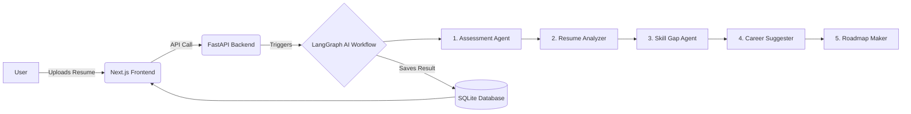

#  SheStarts AI - Empowering Women to Restart Their Careers! 

Hello!  Welcome to **SheStarts AI**, a full-stack AI career counselor I built to help women seamlessly re-enter the workforce after a career break. 

As a passionate developer, I wanted to build something that solves a real-world problem using cutting-edge AI. This project uses a **multi-agent AI workflow** to analyze resumes, find skill gaps, and provide a highly personalized learning roadmap.

---

## 🚀 Live Demo

- **Frontend Application:** [https://career-counselor-ai-pi.vercel.app](https://career-counselor-ai-pi.vercel.app)
- **Backend API:** [https://career-counselor-ai-646u.onrender.com/docs](https://career-counselor-ai-646u.onrender.com/docs)

---
##  Why I Built This (The Problem & Solution)

**The Problem:** Many talented women take a break for personal reasons (maternity, family, health) and find it intimidating to return to the corporate world. They don't know what skills they are missing or which roles suit them best in today's fast-changing market.

**My Solution:** I built an AI agent workflow that acts as a 24/7 personal career coach! It takes their resume and a short assessment, then 7 different AI agents work together to guide them back into the industry with confidence.

---

##  Features That Make It Special

- ** Swarm of 7 AI Agents:** I used **LangGraph** to connect 7 specialized Gemini AI agents. One reads the resume, another finds skill gaps, another suggests jobs, and so on!
- ** Smart Resume Parsing:** Upload a PDF resume and watch the AI extract your skills and give you an ATS score.
- ** 30-60-90 Day Roadmap:** Automatically generates a customized week-by-week study plan to get job-ready.
- ** AI Interview Coach:** Generates 10 behavioral and technical interview questions tailored specifically for the user's target role.
- ** Interactive Dashboard:** Beautiful charts (using Recharts) to visualize the user's job-readiness score!

---

##  Tech Stack I Used & What I Learned

Building this project taught me so much about connecting modern frontend frameworks with AI-powered Python backends!

**Frontend:**
- **Next.js 15 (App Router) & React 19:** Learned how to handle modern React patterns and complex states.
- **Tailwind CSS v4:** For building a beautiful, responsive, and accessible UI from scratch.

**Backend & AI:**
- **FastAPI (Python):** Built blazing fast, asynchronous REST APIs.
- **Google Gemini 1.5 Flash:** Mastered prompt engineering to force LLMs to output strict, structured JSON data.
- **LangGraph:** Learned how to orchestrate complex AI workflows where multiple agents talk to each other!
- **SQLite & SQLAlchemy:** Handled database relationships and async database queries.

---

##  How The AI Works (Architecture)

I designed a simple but powerful flow:



---

##  How To Run My Project Locally

Want to test it out? It's super easy!

### Prerequisites
- Node.js installed
- Python installed
- A Google Gemini API Key (it's completely free to get!)

### Quick Start (For Windows)
I wrote a small script to make starting the app effortless:
1. Clone the repo: `git clone https://github.com/Amansingh223/Career-Counselor-AI-.git`
2. Go to the `backend` folder and create a `.env` file with your API key:
   ```env
   GROQ_API_KEY="your_api_key_here"
   ```
3. Double click the **`start.bat`** file in the main folder! It will automatically install everything and open the app in your browser at `http://localhost:3000`.

### Manual Start (Mac / Linux)

**Backend:**
```bash
cd backend
pip install -r requirements.txt
python -m uvicorn main:app --reload --port 8000
```
**Frontend:**
```bash
cd frontend
npm install
npm run dev
```

---

##  Future Scope (What I plan to add next!)
- [x] Add OAuth (Google/GitHub login) for easier sign-ups.
- [ ] Implement a Mock Interview feature using speech-to-text.
- [ ] Connect with the LinkedIn API to fetch live, relevant job postings.

---
**Thank you for checking out my project!** I am incredibly passionate about software development and currently looking for exciting fresher opportunities to learn and grow. Feel free to explore the code! 
