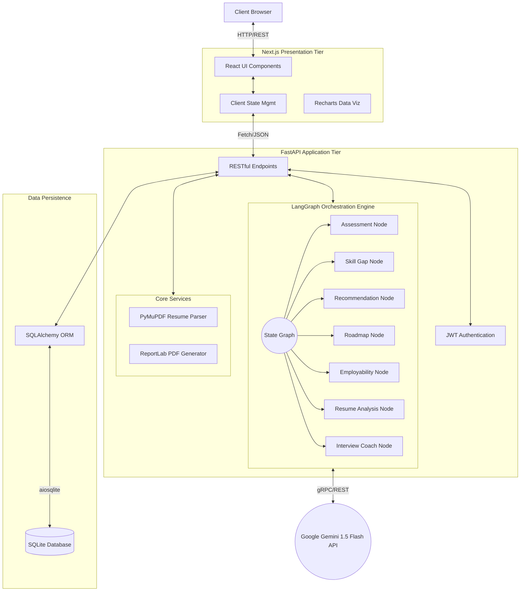

# SheStarts AI Career Counselor

An AI-driven career counseling platform designed for workforce reentry, leveraging a multi-agent LLM architecture to provide personalized skill roadmaps, ATS resume parsing, and interview preparation.

## System Architecture

The application implements a decoupled client-server model, utilizing Next.js for the presentation layer and a FastAPI-based backend that orchestrates Google Gemini LLMs via a LangGraph state machine.



## Technical Stack

### Frontend Application
- **Framework:** Next.js 15 (App Router, Turbopack)
- **Library:** React 19
- **Styling:** Tailwind CSS v4
- **Data Visualization:** Recharts

### Backend Services
- **Framework:** FastAPI
- **Concurrency:** Uvicorn (ASGI), Async I/O
- **AI Orchestration:** LangGraph (Stateful LLM multi-agent workflow)
- **LLM Provider:** Google Gemini 1.5 Flash
- **Document Processing:** 
  - Extraction: PyMuPDF (`fitz`)
  - Generation: ReportLab
- **Authentication:** JWT (JSON Web Tokens) via `python-jose`
- **Data Validation:** Pydantic V2

### Data Persistence
- **Database:** SQLite
- **ORM:** SQLAlchemy (Async Engine)
- **Driver:** `aiosqlite`

## AI Workflow (LangGraph)

The core intelligent processing is handled by a stateful Directed Acyclic Graph (DAG) built with LangGraph. When a user submits an assessment or uploads a resume, the input state is passed through specific agent nodes:
1. **Assessment Extraction:** Parses unstructured user input into structured strengths and weaknesses.
2. **Skill Gap Analysis:** Computes the delta between current competencies and industry standards.
3. **Recommendation Engine:** Determines the top 5 high-probability career paths.
4. **Roadmap Generation:** Synthesizes a chronologically structured 30-60-90 day upskilling timeline.
5. **Employability Scoring:** Quantifies readiness through a weighted heuristic.
6. **ATS Parsing:** Extracts key entities and evaluates resume formatting.
7. **Interview Simulation:** Dynamically generates technical and behavioral questions mapped to the recommended roles.

## Developer Setup

### Prerequisites
- Node.js (v20.x+)
- Python (v3.10+)
- Google Gemini API Key

### Backend Initialization
```bash
# Navigate to the backend directory
cd backend

# Install dependencies
pip install -r requirements.txt

# Configure environment variables
echo GEMINI_API_KEY="your_api_key_here" > .env

# Initialize the database and start the ASGI server
python -m uvicorn main:app --reload --port 8000
```

### Frontend Initialization
```bash
# Navigate to the frontend directory
cd frontend

# Install package dependencies
npm install

# Start the Turbopack development server
npm run dev
```

### Environment Launch Script
For local Windows development environments, a batch script is provided to concurrently bootstrap the ASGI and Next.js servers:
```cmd
.\start.bat
```

## API Documentation
When the backend server is active, interactive OpenAPI documentation (Swagger UI) is automatically exposed at:
`http://localhost:8000/docs`
